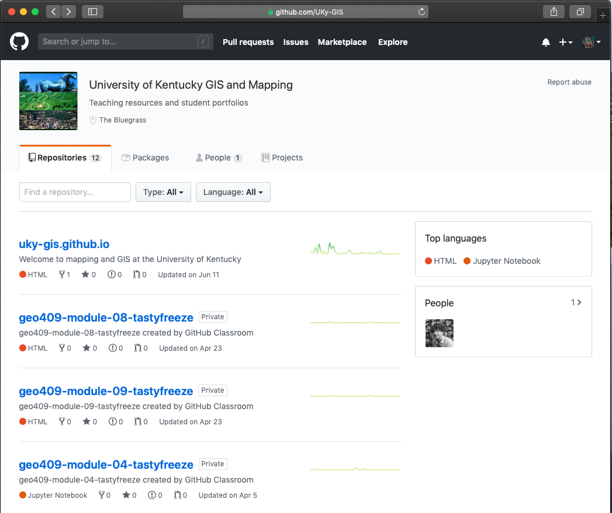

# Lesson 01: Tooling up our workflow

## Goals

This module develops your ability to effectively manage complex, data-intensive projects. We recognize that modern mapping techniques use large amounts of data and text-based instructions, aka *code*, to analyze and process this data. Before we start mapping, we need to cultivate good data hygiene practices and a workflow to manage code.

Let's start by understanding the relationship between code and data. Code is text-based instructions that process data. Code is unique (you wrote it!), but data is mostly redundant (you can download it again and use your code to process it the same way). Code allows us to manage the same project on multiple computers using *Git*, a distributed version control system, and *GitHub*, a web platform for hosting Git projects. You will be able to back up your project, share it on the web, and invite people to collaborate. 

Finally, we will introduce *Python*, the programming language we will use to code our spatial data processing instructions. This module sets the foundation for your journey into Python and collaborating with the instructor.


## Table of Contents

<!-- TOC -->

- [Lesson 01: Tooling up our workflow](#lesson-01-tooling-up-our-workflow)
    - [Goals](#goals)
    - [Table of Contents](#table-of-contents)
    - [Overview](#overview)
    - [Installing VS Code and Python](#installing-vs-code-and-python)
        - [Customizing VS Code](#customizing-vs-code)
    - [Using Git and GitHub](#using-git-and-github)
        - [Introduction: What is Git?](#introduction-what-is-git)
        - [Setting up an (educational) account with GitHub](#setting-up-an-educational-account-with-github)
        - [Download and install GitHub Desktop](#download-and-install-github-desktop)
        - [Cloning down UKy-GIS assignment repositories](#cloning-down-uky-gis-assignment-repositories)
        - [Editing and creating content in a repository](#editing-and-creating-content-in-a-repository)
        - [Push local commits to the remote repository](#push-local-commits-to-the-remote-repository)
        - [What if I need to undo changes?](#what-if-i-need-to-undo-changes)
        - [What happens if I committed a file over 100 MB?](#what-happens-if-i-committed-a-file-over-100-mb)
    - [Why we program and why we use Python](#why-we-program-and-why-we-use-python)
        - [Python for Everyone Videos (required)](#python-for-everyone-videos-required)
    - [GitHub and Git Definitions](#github-and-git-definitions)
    - [Additional Resources](#additional-resources)

<!-- /TOC -->

## Overview

Most software involved in modern mapping practices (and most knowledge-based practices) uses textual files (metadata documentation, web pages, Python scripts, many data formats, etc.). We select tools that make handling these text files as easy as possible. In this lesson, we will introduce specific tools we'll use throughout this course and the process for using them.

**1. VS Code** is a free and open-source code editor developed by Microsoft. It has many features that you'll come to love, such as:

* code syntax highlighting to make code more legible
* beautifying your code to make it more legible
* auto-complete for when you don't want to type or remember that long variable name, and
* many other optional features that help you work in almost any coding environment.

**2. Git**. Git is a software program and what's known as a "distributed version control system." It records changes to the various files in your project (a "repository" or "repo" for short) as you progress through your work. Using Git allows you to track different versions and, if (or when!) you mess up, you can remove the bad addition. Git also facilitates collaboration. We will use Git through GitHub's Desktop client.

**3. Python 3**. Python is a programming language developed in 1991. This language is among the top three popular programming languages globally, with an extensive and helpful user community. Python is designed to be easy for us to read and write. This course assumes you have no previous experience with Python. We will use Python through our primary mapping software, ArcGIS Pro.

**4. Jupyter Notebook** is another free and open-source code editor that mixes Python code blocks with descriptive text. It is a great tool for teaching and learning about Python and is also installed with ArcGIS Pro.

This lesson will introduce these tools and establish a workflow we'll use throughout the course. Note: pay close attention to those sections starting with the 🛠️ symbol. These are sections that directly contribute to completing the lab.

## Installing VS Code and Python

We'll be spending a lot of time using code over the next few months. Having a powerful, customizable text-editor like VS Code makes the process easier and more enjoyable. There are other good text editors to compliment VS Code. Popular ones include [Sublime Text](https://www.sublimetext.com/) (which is among the best editors to handle huge text files), [Brackets](https://brackets.io/), and [Atom](https://atom.io/) the "hackable text editor for the 21st Century." Atom is a project by GitHub, which Microsoft acquired (the creator of VS Code). 

Install [VS Code](https://code.visualstudio.com/).

For Python and Jupyter Notebook, they are installed with ArcGIS Pro and you will be emailed instructions on how to create credentials to use the application. If you're working in the lab, ArcGIS Pro is installed.  To use ArcGIS Pro outside of class, you need a Windows OS. You have a few options.

1) If you have a personal Windows OS computer, you can install ArcGIS Pro from our [organization page](https://my.esri.com/#/downloads) or [uky-edu.maps.arcgis.com](https://uky-edu.maps.arcgis.com/home/user.html#settings) after accepting the invitation and creating credentials.

2) If you are not on a Windows OS (e.g., you are on a macOS), you'll need Windows OS access. The recommended solution is getting a subscription from [Shadow.tech](https://shadow.tech/), which gives you a Windows OS in the cloud from your personal computer. If you select this option (highly recommended for macOS users), you'll need a good internet connection (as found on campus), and you'll need to install ArcGIS Pro (as shown above).

3) UK’s Virtual Den at https://appstore.uky.edu allows access to Windows applications, including ArcGIS Pro, from a browser with your linkBlue ID. This method of using ArcGIS Pro is adequate for processing data and basic maps, but not for visualizing large, 3D datasets.

4) If you are on a macOS, you can use a virtual machine to run Windows and ArcGIS Pro. Popular virtual machines are  [Parallels Desktop](https://www.parallels.com) and [VirtualBox](https://www.virtualbox.org/).

### Customizing VS Code

After installation, you might want to skim through the [Getting started with Visual Studio Code](https://code.visualstudio.com/docs/getstarted/introvideos). Focus on the first three chapters and then the chapter on *Python*. Check out all of the extensions in the [Extension Marketplace](https://marketplace.visualstudio.com/) you can use with VS Code. Learn how to install extensions and different visual themes under [VS Code Extension Marketplace tutorial](https://code.visualstudio.com/docs/editor/extension-gallery).

Check out this extensions:

* **markdownlint** will help you format Markdown documents
* **Spell Right** will do just that
* **Rainbow CSV** highlights CSV files with a rainbow of colors
* **Live Server** to preview your web pages in real time (usd later in the course)
* **Python** and **Jupyter Notebook** to preview and run Jupyter Notebooks.

  
*Installing the Live server extension*

Finally, you will want to customize your editor's appearance, an activity that most users enjoy. Search for **Theme** in Extensions and install one that you like. You can change themes in the application menu **Code > Preferences > Color Theme**.

  
*Quiet Light theme (one of the thousands to use!)*


## Using Git and GitHub

Git is a version control system (VCS) for tracking changes in computer files and coordinating work among multiple people. We'll use Git to keep track of changes to our files and code and share and submit our work on the web with the instructor and other students. Within this module, we're going to cover Git in both a conceptual and practical sense.

### Introduction: What is Git?

Git is a **Distributed Version Control System (DVCS)**. OK, but what's a version control system (VCS)? A VCS records all changes made to a computer file or set of files. This system allows you to review any changes made to files and access previous versions of files or projects. If you mess something up, accidentally delete or copy over a file, you can retrieve an earlier copy of that file.

We're going to use Git with the [GitHub Desktop Client](https://desktop.GitHub.com/) because of the simplicity and ease of use. We'll install this software shortly.

To use Git outside of the GitHub Desktop client, you need to install Git separately and access it through your [command-line interface](https://en.wikipedia.org/wiki/Command-line_interface). If you wish to pursue this more advanced approach, then start with the chapter [Getting started with Git](https://git-scm.com/book/en/v2/Getting-Started-Installing-Git) in the free book titled, [*Pro Git*](https://git-scm.com/book/en/v2).

#### A brief background to Git and history of version control

VCSs have been used for a long time. A very simple form of version control merely is making backups of your files or project directories and storing them on a local computer or network system. Of course, this requires one to keep careful track of files and file names, often manually. Developers use centralized Version Control Systems (CVCSs) to collaborate with others on projects, which used a single server and database to store files and keep track of all versioned files and changes. Examples of these CVCSs include Subversion and Perforce. While CSVSs were better than developers keeping their versions of files on their local machines, this centralized approach also provides a single point of failure. If the server crashed (or even worse, became corrupted), the project was still at risk of being lost.

To address this risk, in recent years, developers have migrated their workflow to Distributed Version Control Systems (DVCS) such as Git, Mercurial, Bazaar, and Darcs. The primary benefit of a DVCS is that every client who "clones" the project fully mirrors the entire repository rather than keeping a single backup of a project. This approach "distributes" a full backup of project files among all local computers working on the project.

Git takes a particular approach to version control. Rather than making a full backup of the project with each version and storing a list of file-based changes like other VCSs, Git saves the state of the project as a "snapshot" of what the files look like at the time of commit (more on "committing" below). If a file has changed since the previous commit, then Git saves those changes and records a reference to it within a "snapshot." If a file hasn't changed, then there is no need to re-copy the file (or the entire project's directory structure!). Git retains the previously stored reference, making it very efficient compared with other VCSs.

Another advantage of Git is that repositories are always downloaded, stored, and manipulated locally  (i.e., no need for server requests), which means Git runs very fast, and you can work even without an Internet connection.

Today, another huge advantage of using Git is its close integration with [GitHub](https://github.com/). **GitHub** is a company that provides a Git-enabled platform to share your Git repositories. This relationship is beneficial as it allows other people to collaborate with you on the same repository. You can even share your projects with the broader public via public web pages. During the course, you will also use this mechanism to submit and share your assignments with your instructors.

### Setting up an (educational) account with GitHub

To get started with GitHub, you first need to create an account (actually, you'll have already made one to access this information, but here it is again).

Navigate to [https://github.com/](https://github.com/) and sign up with a username, password, and email address. **Make sure you use your @uky.edu address as you need it for the next step.** Think carefully about selecting your user name for consistency across your branding. 

Once you create your account, take a moment to update your profile (under **Your profile**) by clicking on the avatar upper-right corner. Uploading an image of yourself (or some other fun image) is preferred, as well as giving your name, location, and a URL to a website if you have one.

GitHub is free to use and now offers private repositories by default. This is very helpful while still learning as we may not want our stumbles and ugly code to be visible to the entire world. Later on, private repositories are when working for a client who wants to keep data and development private for the time being.

Once you're signed up, go to [GitHub Education](https://education.GitHub.com/) and click on the blue "Get Benefits" button. It includes access to GitHub pro tools as well as a bunch of other cool stuff.

  
*GitHub Education*

Sign in with your GitHub account (if you haven't done so already), click "Get student benefits", and follow the instructions. GitHub will ask you to submit a request using your `@uky.edu` account. Once you've submitted, it may take a short while to get approved.

### Download and install GitHub Desktop

Now that we have our remote GitHub account set up on the web let's get Git and the GitHub Desktop running on our local computer. Depending on your operating system, download GitHub Desktop from [https://desktop.github.com/](https://desktop.github.com/).

Once downloaded and opened, GitHub Desktop will ask you to walk through some configuration steps. Enter your GitHub username and password, and then supply your name and email. Please use your real name so that your colleagues and instructors can identify you. This allows the Desktop Client application to pull down files from a remote repository and add, commit, and push changes to files up to a remote repository.

Once the configuration is successful, you should see an empty GitHub window. We're finally ready to roll!

For further documentation on this process, see [Getting Started with GitHub Desktop](https://help.github.com/desktop/guides/).

Now that we have our GitHub account connected to the Desktop Client, we'll use it to complete four critical processes that we'll use each week: 
1. Cloning a repository down to our local machine
2. Editing and creating new content in this repository
3. Synchronizing content between our local and remote repositories
4. Working with a collaborator

### Cloning down UKy-GIS assignment repositories

In every Canvas course module, a URL is provided to the lesson documentation hosted as a GitHub repository. When you click on this link, Github will spawn a private repository for you on the [UKy-GIS Github account](https://github.com/UKy-GIS) using your username as a suffix to the repo name (e.g., *geo409-module-01-username*). Only you and the instructor have access to this repo.

**NOTE:** Throughout this lesson, when "username" is written, you should substitute your own GitHub username. In the example below, *tastyfreeze* is a username.

  
*List of repositories in the UKy-GIS organization*

To begin working in the module, you need to clone this remote repository. Cloning creates an identical copy that can be synchronized across different computers and collaborators.

  
***Open in Desktop** clones the repository to your computer*

GitHub Desktop will then clone (i.e., make a copy of) the *geo409-module-01-username* repository on your local machine. It will create a folder on your hard drive using the repo name as the folder name. Before you clone, let's think about where to place the folder on your local computer.

#### Organizing your local directory structure

Select a location on your computer to save your repository. Please follow these **💡 important guidelines** when selecting and naming a folder and its location. 

- Create a single folder called "geo409" or "MyDistinctNameGIS" (e.g., "BoydsGIS") on your hard drive in a convenient location, such as at the top level of your computer's hard drive. (E.g., *C:\BoydsGIS* for Windows OS or */users/Boyd/gis* on macOS and Linux.) 
- Make sure the folder name has no spaces; use only alphanumeric characters. Check out [good file and folder naming conventions](https://library.si.edu/sites/default/files/tutorial/pdf/filenamingorganizing20180227.pdf)
- Put all course repositories in that folder.
- Do not put a repository inside another repository.
- Repos are managed as folders on your hard drive. If you change the name or move a repo folder, you'll need to reconnect the repo in GitHub Desktop.  
- **Don't worry!** If you placed it somewhere you didn't intend to, we can quickly move it in the future.

After you click **Clone**, GitHub Desktop will copy the repository from the remote webserver to your local machine. Once it's complete, you can verify the process by looking at the repository within your local file/directory structure. (Hint: you can right-click on any repo name within GitHub Desktop and choose **Show in Finder**, **Show in Explorer**, **Open in Atom**, or **Open in VS Code** depending on your operating system and code editor.)

  
*Opening the local repository directory through Finder*

When you open this repository in your file/directory structure, you'll see that the repository is contained within a directory named *geo409-module-01-username*. Within this repo, you'll see the *README.md* file that is this lesson.

You may also see a directory named *.git* (if not, you can enable your operating system to view hidden files). The .git directory is used internally by Git to track your files and changes, and you should not modify this directory. 

Try keeping all of your course assets organized in folders in your top-level or root GIS folder. This method will make it easier to find stuff and help with coding. You will have a mix of repositories and data and project folders that are only local to your computer. Over time, your space might look like the following:

     
*Example directory structure after some time in class*

### Editing and creating content in a repository

Switch back to GitHub Desktop. Note that at the top of the window are two tabs: One says "No Uncommitted Changes." This indicates that you currently have no committed changes recorded by Git, and the panel below indicates "0 changes."

  
*No uncommitted changes in the repository*

Next, click on the **History** tab. This will show you all the committed changes to your repository. Here we see there is the commit history of recent changes made to the repository.

  
*Viewing the commit history of the repository*

All further changes and commits will first happen within your local repository and then pushed up to the repository's remote copy. Let's practice doing that now.

#### Editing an existing file in a repository

🛠️ Launch your text editor if not already open. Choose **File > Open Folder...**, and navigate to your local directory of the *geo409-module-01-username* repository. It is **💡 important** to understand that projects are a folder containing a collection of files (and other folders). When we open a repo folder in our editor (instead of a file inside the repo), we conveniently have access to all of the project assets in the editor's sidebar file/directory tree.

Expand the *lab-01* folder and select the *example.md* file from the VS Code File Explorer, which will open the file in the code editor.

Now type, "OK! I'm ready to start editing files!" In VS Code, click the application menu **File > Save** (keystroke CTRL+S on Windows or CMD+S on macOS) to save the changes.


Now switch back to the GitHub Desktop. We can see at the top of the client that there is "**1 changed file**." Click on the **Changes** tab. You can see any deleted text highlighted in red and the new text highlighted in green in the right-hand panel. In Git-speak, this is called a *diff* — it shows the difference between two versions of the same file. You have removed lines with a small "-" and have added those with a small "+" Green and red colors indicate essential additions/removals.

  
*Seeing one uncommitted change in GitHub Desktop. Save your progress to commit often.*

Next, let's commit this change to our repository. A commit bundles anything that has changed and creates a snapshot of the current state of the repository. Each commit then becomes an individual snapshot that you can access later.

Every commit to a repository requires a commit message. These messages should be short, descriptive changes you made to the files since the last commit. The convention is to use present tense verbs (i.e., "create first text" or "change order of commands"). Find the commit dialog box in the lower-left corner of GitHub Desktop.

  
*Committing a change.*

Enter a commit message entered into the **Summary (required)** field. You can also add a longer description of the commit (such as commits involving many changes to several files). When complete, hit **Commit to master** (or **Commit to main**). Note that we add this commit to the master (or main) branch. 

After clicking **Commit**, GitHub Desktop returns to show there are **"0 changed files"** Clicking back to the **History** panel how displays the most recent commit message.

  
*History panel of GitHub Desktop showing the last commit*

How often should we commit our work to the repository? Commits are snapshots of changes we make to a project that can be rolled back (*reverted*) if a problem emerges. They also provide opportunities to comment on changes. Think about making commits when you've finished a particular task. If you've puzzled through something difficult or created a lot of new content, then "save" this work with a commit.


Regardless of how often you commit, always apply a good commit message. If you collaborate or revisit a project, these commit messages help interpret what you did.

#### Adding files to a repository

🛠️ We just modified and saved a file and then committed that change to our repository. Now let's add a new file to our repository.

In VS Code, choose **File -> New File**, which will open a new untitled document. Save this file within the *lab-01/* directory and name the file *my-info.md*. Ensure the file is saved within your *geo409-module-01-username/lab-01/* directory and not somewhere else in your filesystem. When selecting new file and folder names, it is **💡 important** to please observe some naming conventions we have discussed previously:

* Don't use spaces in names; instead, replace them with dashes `-` or underscores `_` or use CamelCase
* Use only alphanumeric characters, dashes, and underscores, e.g. `abc123_-`
* Keep it simple at first and use only lowercase characters; everything is case-sensitive!
* Always use a file extension with file names; in our case, it is the *.md* file extension.

The extension *.md* stands for Markdown, which is a [text-to-HTML](https://daringfireball.net/projects/markdown/) conversion tool for writing content on the web. It was developed to create well-formatted documentation easily. It is the default *markup language* on Github.com (and many other coding sites) and offers many formatting options. A *markup language* uses keywords or characters to specify formatting and is not displayed when rendered on GitHub.com or when previewed in VS Code. Read more about Markdown in  [The Ultimate Guide to Markdown](https://blog.ghost.org/markdown/).

Within this *my-info.md* file, copy and paste the following Markdown within the VS Code text editor (include the pound sign as it creates a top-level heading in Markdown):

```markdown
# Welcome to Yoda's GIS info page

This space will describe some of my mapping interests and experiences.
```

Save those changes to the *my-info.md* file. Then switch back to your GitHub Desktop. Once again, you should see changes to the repository, and GitHub Desktop shows these as uncommitted changes ("1 changed file" here). On the left, GitHub Desktop shows us on which file those changes occurred (in this case, the *my-info.md* file located within *lab-01/* directory).

  
*A new file added to the repository but not committed*

To preview (render) a Markdown file in VS Code, right the tab and select **Open Preview**.

Add a commit message and then commit this change to the repository. Write a message such as "add markdown file for lab assignment" and click **Commit**. Once again, GitHub Desktop commits that addition to the project's repository and displays that there are now no uncommitted changes.

So far, we've created a new *my-info.md* file. We've safely stored these within our local Git repository. But, we haven't created a backup of these files. If our local machine became corrupted or lost, we'd lose this work. Let's now push these changes up to our remote GitHub account.

### Push local commits to the remote repository

🛠️ To put a local commit on your remote repo (i.e., backup your local repo), you need to *push* the commit. Github Desktop will change the right-hand button from _Fetch origin_ to _Push_ when you have local changes that do not exist on the remote repo. If the button says _Pull_, then the remote repo was altered outside (and ahead) of your local repo, and you need to pull in the changes to stay synchronized. Go ahead and push your changes to the remote.  

  
*Pushing changes to remote repository synchronizes local and remote repos*

Now switch over to your GitHub.com repository in your web browser. Refresh the page to see that your local changes are copied to the remote web server. On your remote repository's main page, find the **Commits** button and click it. It should exactly match your local repository.

  
*Changes to the local repository have been pushed to the remote*

You can see which files were changed and their associated commit messages. You have identical copies on two computers. Behold, the transparency, and power of Git and GitHub!

Note that you don't need to push up changes every time you make a local commit. When you finish for the day or are taking a break, that's a good time to push your local changes, so you have a backup on a remote web server.

#### Pull remote changes before you start working

🛠️ It's likely that you will want to work on multiple computers. When we add collaborators to our project, we'll have even more computers to maintain. How can we keep our project synced across all of these machines?

Github Desktop uses a **Fetch** operation that works continuously in the background. A fetch will collect all of the remote changes and compare them to your local repository. Get in the habit of clicking the **Fetch Origin** button before you start working, and then pull any remote changes to ensure you are always working with the most recent copies of the files in the repository.

     
*Steps in working with a repository on multiple computers*

Imagine a scenario where you're working on a project at home and the computer lab. If you made many changes at home but forgot to pull them into your copy at the lab, you might write on the same lines in the same file. When you eventually pull in remote changes (you have to pull before you push), you will have a *merge conflict* unless the text is the same in both files. You will then have to manually decide which lines are the correct versions that you will keep in your project. Thankfully, VS Code will help you compare which changes you want to keep.

### What if I need to undo changes?

Suppose the changes have been saved but not committed; let's *discard* the changes. In GitHub Desktop > Changes tab, right-click the most recent uncommitted change and select **Discard Changes...**.

If you've committed the change, you can undo the most recent commit easily with a *revert*. In GitHub Desktop > History tab, right-click the most recent commit and select **Revert Changes in Commit**. This returns your repo to the state before you made the last commit. 

### What happens if I committed a file over 100 MB?

It is **💡 important** to put all downloaded data in a folder outside of any repository. If you have sample data that you want to share in the repository (e.g., an output from a tool), make sure it is no larger than 50 MB. Remember, downloaded data is redundant, and we can always get it again.

While you can commit any file size locally, you cannot push a file to GitHub that is over 100 MB. If you've made many commits since you added the large file (and didn't notice GitHub Desktop's warning), you have a simple way to repair your project.

1) Rename the local repository
2) Clone down a new copy of the remote repository. It will be at the commit state immediately before adding the large file if you frequently push up changes. 
3) Rebuild the newly cloned repo by adding the old repo's changed files to the new repo — minus the large file.

## Why we program and why we use Python

Python is a programming language <a href="https://www.youtube.com/watch?v=xLVxoz-mQFs">developed by Guido van Rossum</a> in 1991. The name "Python" derives not from a snake (despite the appearance of the official logo) but from [Monty Python's Flying Circus](https://en.wikipedia.org/wiki/Monty_Python%27s_Flying_Circus), of which Rossum was a big fan. Since that time, the Python community of developers and users have created one of the most popular, powerful, and easy-to-learn programming languages in history. Any search on the [popularity of Python](https://duckduckgo.com/?q=popularity+of+python+programming+language) will demonstrate its prevalence in many fields.

It is an interpreted, high-level language designed to be easy for us to read and write. An interpreted programming language uses a software interpreter that translates step-by-step a human-readable language to machine language. By comparison, low-level computer languages use a <a href="https://en.wikipedia.org/wiki/Compiled_language">compiler</a> to create a program that is directly executable on machine hardware.

With cheap, powerful computers today, the extra step of interpretation is not a hindrance. The advantage of using an interpreter is the ability to write more syntactically familiar code. In some cases, it might feel like writing sentences when coding in Python. 

Another reason we use Python is that it is the [scripting language of ArcGIS Pro](https://pro.arcgis.com/en/pro-app/latest/arcpy/get-started/installing-python-for-arcgis-pro.htm), our primary mapping application. A *script* is a program or set of instructions that help us perform tasks more efficiently. The scripts we develop in this course will automate data collection and processing, so we can spend more time creating visualizations. 

### Python for Everyone Videos (required)

<a href="https://www.py4e.com/lessons/intro"></a>    
*Watch the four videos from [PY4E: Why Program?](https://www.py4e.com/lessons/intro).*

We will use video presentations by Chuck Severance from his [Python for Everybody](https://www.py4e.com/) course in the first few modules. These videos run approximately 12 minutes each and give a good introduction to programming. Watch the four-part video series about why we program and skip the asides and exercises.

OK! You have successfully finished this lesson and now can turn to the [assignment](lab-01/README.md). Remember to save, commit, and push often to back up your work!


## GitHub and Git Definitions
* **Git**: A (distributed) version control system that allows you to manage (and revert) changes to (text) files.
* **GitHub.com**: An online platform built on top of Git that allows for online collaboration and sharing of Git repositories
* **GitHub Desktop**: A program that allows for the management of Git repositories through a graphical user interface (instead of a command line)
* **Repository**: A directory containing all of a project's files, managed by the Git workflow
* **Commit**: A specific snapshot of a project's files
* **Revert**: Undoing one (or more) commit, basically returning back to a previously saved version of a project
* **Clone**: A copy of a remote repository to a local machine
* **Fork**: A carbon-copy clone of another person's remote repository to one that's owned by yourself
* **Remote repository**: A Git repository that exists on a remote server, most often the GitHub.com platform
* **Branch**: A specific *context* of a repository. Often used to work on a particular feature or new idea
* **Merge**: Branches can be merged back into the main branch. This brings all the commits made on a specific branch into the main context of the project. E.g., if a certain feature proves useful, it can be added to the main project at that time.

## Additional Resources

* [GitHub Guides](https://guides.github.com/)
* [Learn VS Code introductory videos](https://code.visualstudio.com/docs/getstarted/introvideos)
* [Python for Everybody textbook](https://www.py4e.com/html3/)


