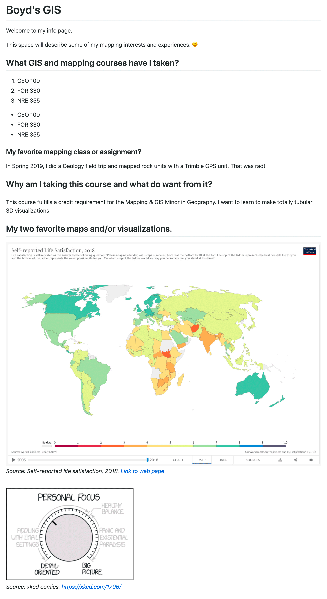

# Lab 01: Working with standard file formats in GitHub Repositories

This lab assignment builds from the material and processes covered in lesson 01. Please complete the lesson before continuing.

## Table of Contents

<!-- TOC -->

- [Lab 01: Working with standard file formats in GitHub Repositories](#lab-01-working-with-standard-file-formats-in-github-repositories)
    - [Table of Contents](#table-of-contents)
    - [First steps in writing code](#first-steps-in-writing-code)
        - [Using comments](#using-comments)
    - [Part I. Complete Lesson (2 pts)](#part-i-complete-lesson-2-pts)
    - [Part II. Adding new content in your repository (8 pts)](#part-ii-adding-new-content-in-your-repository-8-pts)
        - [Complete your my-info.md](#complete-your-my-infomd)
    - [Submission](#submission)
        - [Evaluation and feedback](#evaluation-and-feedback)

<!-- /TOC -->

## First steps in writing code

You will create and edit content in multiple formats. In this assignment, you'll use [Markdown](https://en.wikipedia.org/wiki/Markdown), a *markup* language which uses reserved character strings (sometimes called *keywords*, *reserved words*, and *markup*) to represent formatting and page structure, e.g., `**Bold Text**` renders as **Bold Text**, minus the `**` double asterisks character string. 

In whatever format you write, you are writing plain text, so you need a code editor like VS Code to recognize reserved words. How does a code editor do this? The file name needs to include the file extension. Markdown uses the `.md` file extension, Python uses `.py`, and Jupyter Notebook (the file format will use in ArcGIS Pro to execute Python) uses `.ipynb`. Without a file extension, a code editor, browser, etc., will not understand the file format.

The goal is to recognize code *syntax*, i.e., what parts of the text are content and what parts are keywords or comments. This recognition will be an essential skill when you start working with code in earnest. If you've completed the lesson, you already have a good text editor that will *highlight* code syntax with unique colors and help you recognize patterns to understand the code better.

### Using comments

Every language uses some characters to add comments that help the reader understand the author's intention; comments are an essential part of the early writing process. In Markdown, the following character set defines a comment `<!-- -->`. Any characters between `<!-- -->` are not rendered. 

```md
<!-- I am a comment in Markdown. -->
<!-- 
    Use me often to explain your intention.
    Good comments can help you understand the history of a project when you revisit it.
-->
```

In Python, a comment begins with `#` hashtag. Any characters after a `#` are not executed or read by the interpreter.

```py
# I am a comment in Python!
print("Hey, Geography, Y'all!") # Comment here, too!
```

## Part I. Complete Lesson (2 pts)

After completing the lesson, you should have one new file in your repository. Make you have the following in your module repository before continuing. Also, make sure the files have the correct content as demonstrated in the lesson.

```txt
file: geo409-module-01-username/lab-01/my-info.md
```

## Part II. Adding new content in your repository (8 pts)

Markdown is by far the easiest way to create consistently well-formatted documentation. It was created in 2004. The original authors aimed to enable people "to write using an easy-to-read and easy-to-write plain text format, optionally convert it to structurally valid" HTML (HyperText Markup Language, the language used by web browsers). In our workflow, we're are using Markdown to write simple HTML quickly.

As you work through this section, look at GitHub's [Markdown Cheatsheet](https://github.com/adam-p/markdown-here/wiki/Markdown-Cheatsheet) to understand how to format your content. To view a rendered version of your Markdown file, you can push it to GitHub.com and use your browser to read the file. In VS Code, you can right-click the Markdown filename or file tab and click **Open Preview**.


### Complete your my-info.md

Complete the following in your new *my-info.md* file. Answer the following four questions with properly formatted Markdown content.

1. What mapping and GIS courses have you taken? List the course names.
2. What was your favorite mapping class and assignment? Provide two sentences. 
3. Why are you taking this course, and what do you hope to learn? Provide two sentences. 
4. What are two maps and data visualizations that you find interesting? Provide two images and links to sources.


#### Example

Use the following code as guidance to make an adequately formatted Markdown document. Please pay close attention to Markdown's syntax to understand what characters represent document formatting and how they are used. Take note of how whitespace is used around these special characters, too.

```markdown
<!-- Heading 1 -->
# Boyd's GIS

<!-- First paragraph -->
Welcome to my info page.

This space will describe some of my mapping interests and experiences. 😃

<!-- Heading 2 -->
## What GIS and mapping courses have I taken?

<!-- Ordered list -->
1. GEO 109
2. FOR 330
3. NRE 355

<!-- Unordered list -->
* GEO 109
* FOR 330
* NRE 355

<!-- Heading 3 -->
### My favorite mapping class or assignment?

In Spring 2019, I attended a Geology field trip and mapped rock units with a Trimble GPS unit. That was rad!

## Why am I taking this course, and what do I want from it?

This course fulfills a credit requirement for the Mapping & GIS Minor in Geography. I want to learn to make totally tubular 3D visualizations.

## My two favorite maps and visualizations.
<!-- Display JPG image from local source. Notice the exclamation mark ! -->

<!-- Italicized caption with link to source-->
*Source: Self-reported life satisfaction, 2018. [Link](https://ourworldindata.org/grapher/happiness-cantril-ladder)*

<!-- Display PNG image from a remote source. Notice the exclamation mark ! -->
     
<!-- Italicized caption with link to source-->
*Source: xkcd comics [https://xkcd.com/1796/](https://xkcd.com/1796/)

<!-- 
    This text is a comment. The above line grabs a PNG from a URL and will display it as an image. The "Finding a healthy balance" text inside the brackets is called an Alt property and is used if the image is corrupted or for browsers that don't display images (they exist). 
-->

```

When it is placed inside a GitHub.com web server or previewed in VS Code, it will render to this: 

<hr>



<hr>


## Submission

With the successful completion of this lab, you will be able to manage complex projects on multiple machines and start experimenting with writing code.

Push up your final commits and paste the URL link to this repository, e.g., *https://github.com/UKy-GIS/geo409-module-01-username*, in our Canvas Assignment by the due date.

### Evaluation and feedback

You will find two ways to receive feedback after your submission. First, check your Assignment Submission Comments for text or video comments. Second, check your repository.

After you submit your repo's URL, the instructor will clone the repository (making a third synced copy of the repo) and make recommended changes to your code. We are now collaborators on this project, and it is **💡 important** to fetch and pull down any changes in GitHub Desktop before you view the evaluation or want to work on it in the future.

The instructor will make a *pull request* that notifies you that a request has been made to pull in these changes. You might see an email from GitHub or visit the request on GitHub.com. The instructor will *merge* the changes automatically and close the request. Using GitHub Desktop, pull down the changes and view them in VS Code. 

