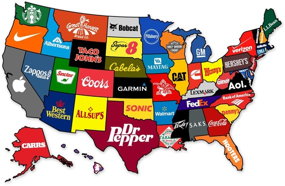

<!-----Big Heading----->

# Welcome to Andre's GIS info page

<!-- Heading 1 -->
## Andre's GIS

<!-- First paragraph -->
Welcome to my info page.

 This space will describe some of my mapping interests and experiences. 😃

<!-- Heading 2 -->
## What GIS and mapping courses have I taken?

<!-- Ordered list -->
1. GEO 109
2. GEO 305
3. GEO 309
4. GEO 405G
5. GEO 419
6. GEO 509
 

<!-- Unordered list -->
* GEO 305
* GEO 509
* GEO 419
* GEO 309
* GEO 109
* GEO 405G

<!-- Heading 3 -->
## My favorite mapping class or assignment?

In Fall 2021, I analyzed and mapped the Preston Ave. Corridor in Louisville, Kentucky for GEO 509. The goal was to find different factors that contributed to the current statistics around the area. For example, my group analyzed different food banks and job centers to determine why the rate of poverty and the percentage of high school and bachelor's degree contributed to low income districts.

## Why am I taking this course, and what do I want from it?

Originally, this course was to fullfill a course requirement for the Mapping & GIS minor. However, I completed GEO 405G to subsitute the requirement. I decided to take this class anyway so I can gain more experience in using GIS technology. 

## My two favorite maps and visualizations.
<!-- Display JPG image from local source. Notice the exclamation mark ! -->

<!-- Italicized caption with link to source-->
*Source: The Atlantic, 2013. [Link to web page](https://www.theatlantic.com/business/archive/2013/06/map-the-most-famous-brand-from-every-state/277129/)*

<!-- Display PNG image from a remote source. Notice the exclamation mark ! -->
     
<!-- Italicized caption with link to source-->
*Source: CNBC make it, 2021 [https://www.cnbc.com](https://www.cnbc.com/2016/12/21/former-google-career-coach-shares-a-useful-visual-trick.html)*

<!-- 
    This text is a comment. The above line grabs a PNG from a URL and will display it as an image. The "Finding a healthy balance" text inside the brackets is called an Alt property and is used if the image is corrupted or for browsers that don't display images (they exist). 
-->
